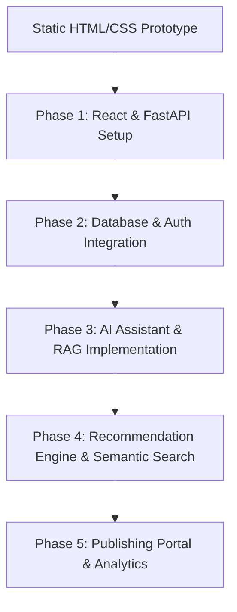

# 📂 Current Project Structure & Implementation Plan

This document details the current state of the Bookstore project, including its current file structure, active technology stack, user flows, and the concrete implementation plan to migrate from this static prototype to the proposed **AI-Powered Digital Library & Publishing Platform**.

---

## 🏗️ Directory Layout

The current project is organized as a static, frontend-only web application:

```text
d:/Pulkit/bookstore/
├── .vscode/                                     # Editor settings and workspace config
├── css/                                         # Specialized page stylesheets
│   ├── login.css                                # Styles for the login form interface
│   ├── register.css                             # Styles for the register form grid
│   └── style.css                                # Global styling, layout, navbar, cards, footer
├── img/                                         # Local images and book cover assets
│   ├── Clean code.png                           
│   ├── Atomic Habits.jpg                        
│   ├── college logo.jpg                         # Brand logo used in Navbar
│   └── ... (other book covers)
├── index.html                                   # Main landing page (hero & shelves)
├── catalogue.html                               # Book catalog with filter category chips
├── cart.html                                    # Shopping cart simulator page
├── login.html                                   # User login interface
├── register.html                                # User registration interface
├── PROJECT_SUMMARY.md                           # Documentation: Upgrade specifications
├── PROJECT_STRUCTURE.md                         # Documentation: Current state & plan (this file)
└── AI_Powered_Digital_Library_Project_Proposal.docx # Original raw project proposal document
```

---

## 🛠️ Technology Stack Currently Used

1.  **Frontend Markup:** HTML5 (semantic layout using elements like `<nav>`, `<section>`, `<aside>`, `<main>`, `<article>`, `<footer>`).
2.  **Frontend Styles:** Vanilla CSS3 (custom stylesheets with flexbox, CSS grid, hover transitions, linear gradients, and responsive card lists).
3.  **Frontend Logic:** Vanilla JavaScript (ES6+ client-side logic embedded directly in HTML script blocks).
4.  **Database/Backend:** None. Currently, all book details, prices, and categories are hardcoded as static HTML elements in [index.html](file:///d:/Pulkit/bookstore/index.html) and [catalogue.html](file:///d:/Pulkit/bookstore/catalogue.html).

> [!IMPORTANT]
> **🎨 Frontend Design Spec & Build Status:**
> *   **Visual Goal:** Adopted a **3D Academic Light Theme** (using soft cream-yellow gradient backgrounds, rounded white glass cards with warm shadows, orange-to-yellow gradient action triggers, and 3D hover rotation layers).
> *   **Build Status:** Completed! Overhauled `index.html`, `cart.html`, `login.html`, and `register.html` to match the custom screenshot designs, and created new compatible views for `publishing.html`, `chatbot.html`, and `marketplace.html`.


---

## 🔍 Detailed Current File Analysis

### 1. Landing Page ([index.html](file:///d:/Pulkit/bookstore/index.html))
*   **Structure:** Has a navbar showing links to Cart, Login, and Register.
*   **Sections:**
    *   *Hero section:* Bold welcome text, subtitle, search CTA, and featured banner.
    *   *Curated Shelves:* Displayed in a responsive 4-column CSS grid:
        *   **Programming Essentials:** (Clean Code, Pragmatic Programmer, Grokking Algorithms, Designing Data-Intensive Applications)
        *   **Psychology & Mind:** (Thinking Fast and Slow, Atomic Habits, Predictably Irrational, The Power of Habit)
        *   **Self-Improvement:** (Ikigai, The Subtle Art of Not Giving a F*, You Can Win)
    *   *Trending Widget:* A 3-column list displaying editor picks and easy reads.
    *   *Footer:* Standard contact info and copyright.

### 2. Catalogue Browser ([catalogue.html](file:///d:/Pulkit/bookstore/catalogue.html))
*   **Category Filter Chips:** Interactive HTML chips with categories: *All, Programming, Cybersecurity, AI/ML, Data Science, Psychology, Self-Improvement, Entrepreneurship*.
*   **Logic:** A vanilla JS event listener matches dataset attributes (`data-category`) and toggles `display: none` / `display: ""` on book card nodes when chips are clicked.

### 3. Shopping Cart ([cart.html](file:///d:/Pulkit/bookstore/cart.html))
*   **Logic:** Implements interactive unit updates:
    *   `updateTotal()` / `increaseQuantity()` / `decreaseQuantity()` to compute subtotals dynamically.
    *   A mock checkout trigger showing an alert modal containing purchase summary details.
    *   "Remove item" prompt that redirects the user back to the homepage.

### 4. Forms ([login.html](file:///d:/Pulkit/bookstore/login.html) & [register.html](file:///d:/Pulkit/bookstore/register.html))
*   Provides input validation skeletons with standard form elements and clean CSS designs.

---

## 🚀 Step-by-Step Backend & Frontend Migration Plan

To upgrade the static application to the target **AI-Powered Digital Library & Publishing Platform**, follow this plan:



### Phase 1: Tech Stack Setup
*   **Frontend Setup:** Initialize React SPA using Vite or Next.js. Define custom Tailwind configuration parameters for warm cream-yellow color tokens, shadows, and perspective variables.
*   **Backend Initialization:** Setup a Python FastAPI structure (`/backend`) with a virtual environment. Use poetry or pip for dependency management.
*   **Database Setup:** Configure a PostgreSQL database instance. Define ORM models using SQLAlchemy/SQLModel for tables: `users`, `books`, `borrow_records`, `reviews`, `user_points`.

### Phase 2: React Porting & Authentication
*   **Component Refactoring:** Convert the light academic 3D HTML pages into modular React components mimicking the warm cards layout and dialog behaviors.
*   **Auth Integration:** 
    *   Implement user sign-up/login APIs in FastAPI using password hashing (`passlib`) and JWT generation (`pyjwt`).
    *   Create a React authentication context to store the active user token in localStorage and manage state access control.


### Phase 3: AI Chatbot & RAG Integration
*   **LLM Setup:** Connect to the Gemini API (`google-generativeai` package) on the FastAPI backend.
*   **Vector Indexing:** Set up a vector database (ChromaDB or FAISS). Write a script to convert book titles, descriptions, and categories into vector embeddings using Sentence Transformers (e.g., `all-MiniLM-L6-v2`).
*   **RAG Engine:** Configure the chatbot route to:
    1. Receive a user query.
    2. Retrieve semantically similar books/inventory from the vector DB.
    3. Inject retrieved context into the prompt sent to the Gemini LLM.
    4. Return conversational recommendations back to the client.

### Phase 4: Dynamic Cart, Borrowing, & Recommendations
*   **Cart & Checkout State:** Replace mock static calculations in [cart.html](file:///d:/Pulkit/bookstore/cart.html) with a global frontend cart store (e.g., Zustand or React Context). Hook it to borrowing record endpoints in PostgreSQL.
*   **Personalization Engine:** Build Python ML pipelines using scikit-learn to suggest books based on user reading records (collaborative filtering) and genre tags (content-based filtering).

### Phase 5: Publisher Workspace & Review Marketplace
*   **Publishing Dashboard:** Create writer forms to upload custom manuscripts, cover images (uploaded to AWS S3/Cloudinary), and titles.
*   **Auto-Tagging:** Run text classification on uploaded documents to automatically predict tags.
*   **Reader Token Rewards:** Implement simple double-entry point transaction ledgers to reward readers with virtual points for detailed feedback submissions.
